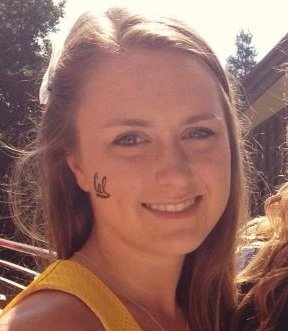

{:.avatar}

## Rachel Hoffman
I am a graduate of the University of California, Berkeley, class of 2014. I have worked in marketing and communications for the past several years and am currently studying computer engineering at SoftStack Factory.
  

## Currently
SoftStack Factory is a 12-week immersion software development bootcamp that teaches hybrid mobile development. We spent the 12 weeks learning JavaScript and frameworks that allowed us to create mobile frontends and backend servers to support our mobile applications.
  
At SoftStack Factory we worked on a real world application for a client where I was a team member in delivering the solution to the client. This project took the team 6 weeks to complete, where we had a kickoff meeting with the client, we then created wireframes via Balsamic that were then approved by the client. The work was assigned using pivotal tracker an Agile project management tool where I was focused on the mobile User interface team. The Hybrid mobile application was built using the Ionic framework and it’s command line tools that facilitated the creation of native application using JavaScript and other web technologies. We also created an mBaaS to support the frontend, in which I spent testing the REST services that the front end used.
 

 
## Education

`2016` 
__SoftStack Factory__  

`2010-14` 
__University of California, Berkeley__  
_B.A. Political Economy_

`2008` 
__University of California, San Diego__  
_Jacobs School of Engineering, COSMOS_

`2006-2010` 
__Canyon Crest Academy__ 

 
## Technical skills

* HTML/CSS, Javascript
* MEAN Stack (MongoDB, Express, Angular, Node)
* Ionic
* Balsamiq
* Git (GitHub)
* SQL

 
## Projects
__Flapper News__ 
_Social media web application_ 
Created a Reddit clone using the MEAN stack, including building a REST interface with Express.js on top of Node.js and using that interface to perform CRUD operations on a database via an AngularJS frontend. Application allowed users to create new posts, view all posts ordered by upvotes, add comments about a given post, view comments for a given post, and upvote posts and comments. Visual styling used Twitter Boostrap.

__T.K. Test__ 
_Hybrid mobile testing application_ 
Created a testing application in which users can take a test multiple times and view their past results. Application was built using Ionic and AngularJS, with a backend built using MongoDB, NodeJS, and Strongloop. Backend models included a user model (to allow for registration and login), a question model (to pull questions and answer choices), and a results model (to store past test results).

__Woodwork__ 
_Hybrid mobile scheduling application_ 
Created a custom scheduling application for soccer players in which users can input their game dates, times, and opponents, and then log game scores and notes as well as view statistics. Application was built using Ionic and AngularJS, with a backend built using MongoDB and NodeJS. Backend models included a user model (to allow for registration and login), a schedule model (to store game dates, times and opponents), and an opponents model (to store opposing team names). Styling used custom CSS.

__RideShare!__ 
_Hybrid mobile ride-sharing applications_ 
Worked in a team of 9 to create a ride-sharing application in which users can post a trip or request a ride and are matched based on various factors and preferences. Application was built using Ionic and AngularJS, with a backend built using MongoDB and NodeJS. Backend models included a user model ( to allow for registration and login as well as preferences), a vehicle model (to store vehicle information), a trips model (to store trips posted by drivers), a rides model (to store rides requested by riders), and a ratings model (to store ratings of riders and drivers).

 
## Experience

`2015-2016` 
__UC San Diego Business and Financial Services__ 
_Marketing and Communications Specialist_ 
Produce collateral marketing material including banners, posters, portfolios and more using Adobe Creative suite applications. Design graphic icons for various departments for use in both web and print formats. Produce and edit promotional videos using iMovie film editing software. Renovate and refine email marketing campaign newsletter using Mail Chimp (8,500+ recipients). Coordinate the design and execution of various presentations and events.

`2015` 
__UC Berkeley Recreational Sports Department__ 
_Marketing and Communications Specialist_ 
Assist in the design and delivery of experiential marketing events including. Research and solicit campus, local, and national sponsors. Design and deliver marketing, advertising, and public relations activities. Assist with the coordination of photography and video materials. Design and deliver a monthly online newsletter. Design and deliver social media campaigns for experiential events and customized partner activations. Assist with budget preparation and implementation.

`2014` 
__UC Berkeley Recreational Sports Department__ 
_Senior Marketing Assistant_ 
Design graphics for email marketing campaigns using Adobe Creative Suite products. Assist in crafting a strategy for engaging 30,000 students. Blend social media and communications with experiential marketing. Design and edit monthly B2B newsletter. Manage Pinterest business account, increasing engagement by over 250%.

`2013-2014` 
__UC Berkeley Recreational Sports Department__ 
_Marketing and Communications Assistant_ 
Develop, update, and manage content for two University of California websites using Word Press and HTML coding. Develop and deliver content for e-marketing campaigns using MailChimp and Constant Contact. Develop and publish news updates.

 
## Hobbies

* Coding
* Soccer 
* Baking

 
## Links

<i class="fa fa-envelope"></i><a href="mailto:hoffman.rachelmarie@gmail.com">Email</a> 
<i class="fa fa-github"></i> <a href="https://github.com/rhoffmanssf">GitHub Account</a> 
